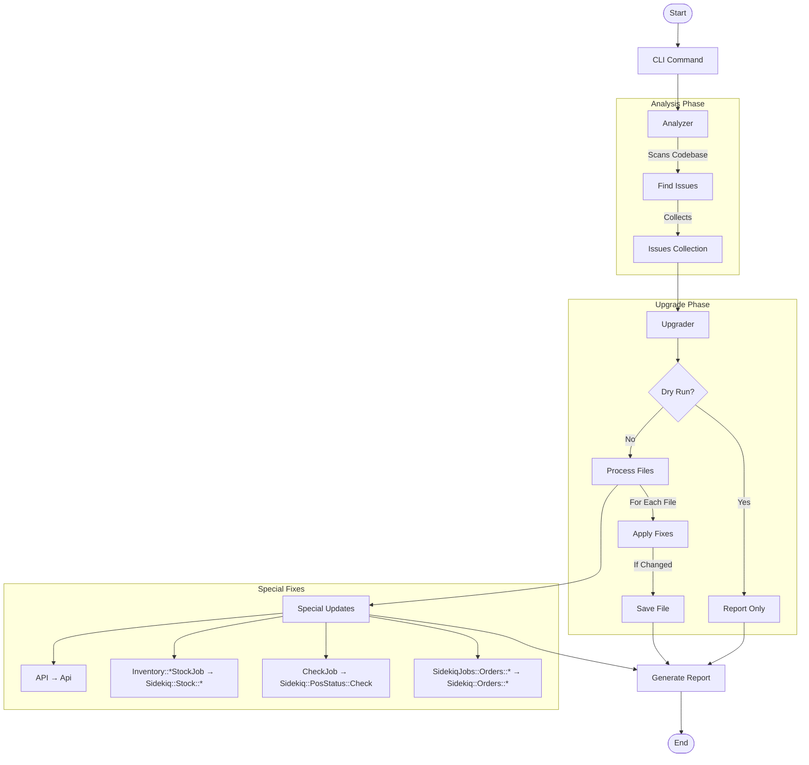

```mermaid
flowchart TD
    Start([Start]) --> CLI[CLI Command]
    CLI --> Analyzer[Analyzer]
    
    subgraph AnalysisPhase["Analysis Phase"]
        Analyzer --> |Scans Codebase| FindIssues[Find Issues]
        FindIssues --> |Collects| Issues[Issues Collection]
    end
    
    Issues --> Upgrader[Upgrader]
    
    subgraph UpgradePhase["Upgrade Phase"]
        Upgrader --> DryRun{Dry Run?}
        DryRun --> |Yes| Report[Report Only]
        DryRun --> |No| ProcessFiles[Process Files]
        
        ProcessFiles --> |For Each File| ApplyFixes[Apply Fixes]
        ApplyFixes --> |If Changed| SaveFile[Save File]
    end
    
    ProcessFiles --> SpecialUpdates[Special Updates]
    
    subgraph SpecialFixes["Special Fixes"]
        SpecialUpdates --> APIModule["API → Api"]
        SpecialUpdates --> StockJobs["Inventory::*StockJob → Sidekiq::Stock::*"]
        SpecialUpdates --> POSStatus["CheckJob → Sidekiq::PosStatus::Check"]
        SpecialUpdates --> OrderJobs["SidekiqJobs::Orders::* → Sidekiq::Orders::*"]
    end
    
    SaveFile --> GenerateReport[Generate Report]
    Report --> GenerateReport
    SpecialUpdates --> GenerateReport
    GenerateReport --> End([End])
```
